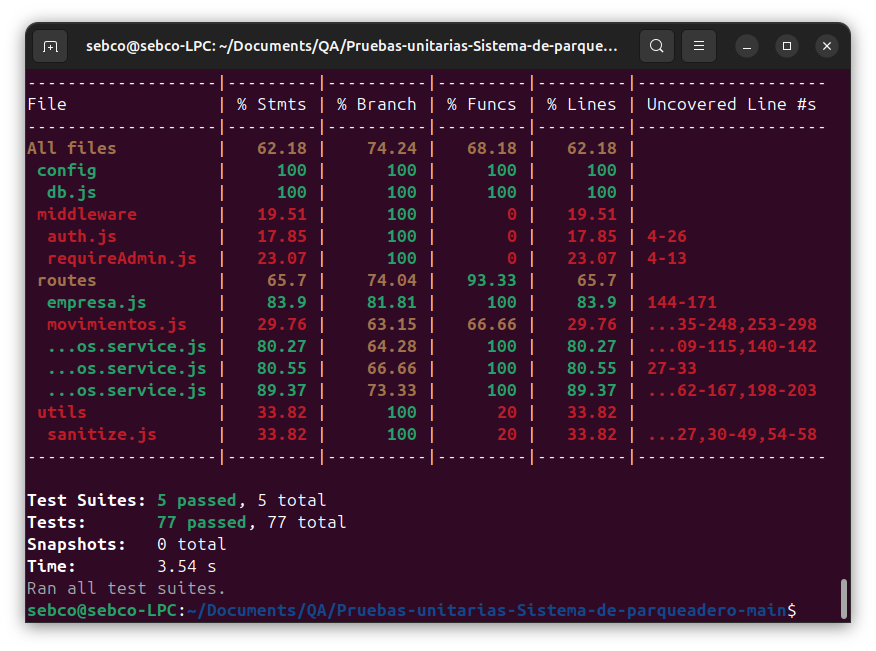

# Sistema de Parqueadero (Multi-empresa)

Aplicación Node.js + Express para gestionar parqueaderos con múltiples empresas, usuarios y operaciones de ingreso/salida de vehículos, tarifas, pagos, reportes y turnos de caja. Incluye una interfaz estática en public/ servida por el mismo servidor.

# Ejecución del proyecto

## Instalación

En la raíz del proyecto se encuentran los pasos originales de instalación y ejecución del proyecto. Toda la información se encuentra en el [README Original](DocumentaciónInstalación.md).

## Testing

1. Antes de correr las pruebas se debe instalar todas las dependencias con el comando:

```bash
npm install
```
2. Una vez instaladas las dependencias, se ejecuta el siguiente comando en la raíz del proyecto:

```bash
npm test
```

# Avances realizados
- Avance 1 - 14/10/25 - Entregado
    - Plan de calidad reducido
        - Se desarrolló un plan de calidad que plantea la estrategia de aseguramiento de calidad de todo el proyecto. El mismo se encuentra en la carpeta de [documentos](/docs) como `PlanDeCalidad.pdf`.
    - Datos y casos de prueba
        - Para cada caso de prueba elaborado se adjuntó el conjunto de datos de prueba a utilizar. Se especificó un conjunto de datos válido que se supone debe pasar exitosamente el caso de prueba y un conjunto de datos que pretenda hacer que el caso de prueba falle.
        - Dentro de la carpeta de [documentos](/docs) se encuentra el archivo `CasosDePrueba.pdf` con toda la información pertinente.
- Avance 2 - 09/11/25 - Entregado
    - Pruebas unitarias
        - Se implementaron pruebas para diferentes componentes del proyecto que manejaban la capa de servicios (asumiendo una arquitectura de 3 capas donde la capa intermedia es la de servicios). Las mismas se encuentran dentro de la carpeta de [tests unitarios](src/test/unit/).
    - Configuración de herramienta de reportes
        - Para la generación de reportes de pruebas se utilizó Jest, eligiendo V8 como proveedor de cobertura. Se prefirió V8 por encima de Babel debido a que es más rápido, mide directamente el código que ejecuta Node.js y requiere menos configuración adicional.
        - Jest genera el [reporte de cobertura](coverage/lcov-report/index.html) en formato HTML y puede verse en línea desde la [GitHub Page](https://an-gi.github.io/Pruebas-unitarias-Sistema-de-parqueadero/reporte/lcov-report/) del repositorio.

<p align="center">
  
</p>

- Avance 3 - 02/12/25 - Pendiente
    - Pruebas automatizadas
    - Informe de reporte de errores
    - Análisis de los problemas


